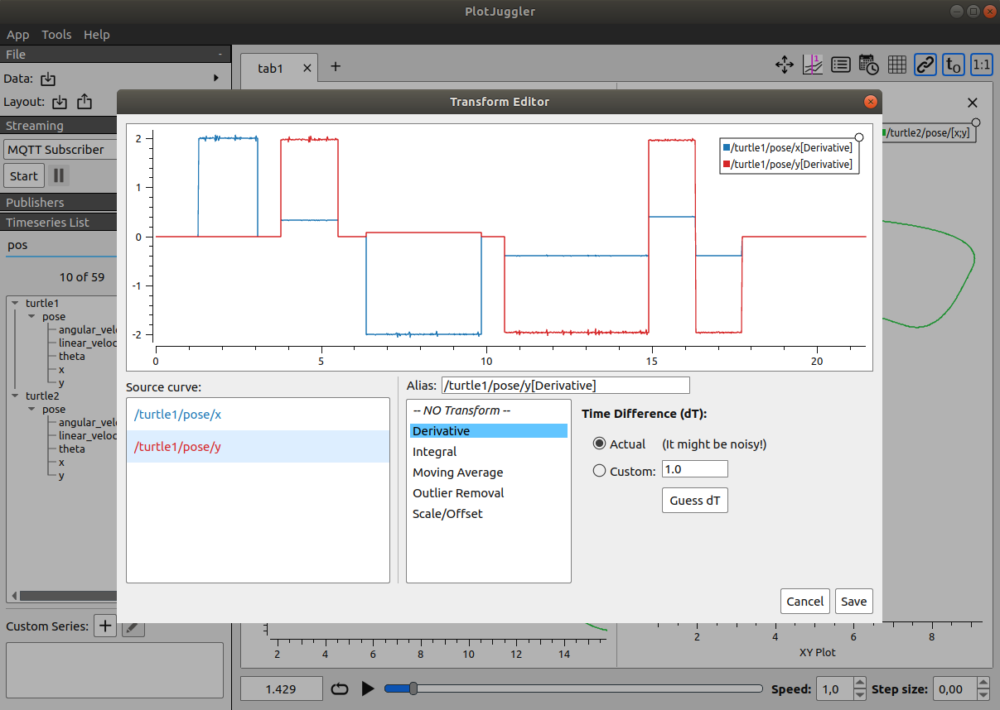

     

# PlotJuggler 3.0.0

PlotJuggler is a tool to visualize time series that is **fast**, **powerful** and  **intuitive**.

Noteworthy features:

- Simple Drag & Drop user interface.
- Load __static data from file__. 
- Connect to live __streaming__ of data.
- Save the visualization layout and configurations to re-use them later.
- Fast **OpenGL** visualization.
- Can handle **thousands** of timeseries and **millions** of data points.
- Transform your data using a simple editor: derivative, moving average, integral, etc…
- PlotJuggler can be easily extended using __plugins__.

To see what PlotJuggler can do for you, take a look at [this 5 minutes video](https://vimeo.com/214389001) 

## Data sources (file and streaming)

- Load CSV files.
- Load ULog (PX4).
- Subscribe to many different streaming sources: MQTT, Websockets, ZeroMQ, UDP, **ROS**, etc.
- Understands data formats such as JSON, CBOR, BSON, Message Pack, etc.
- Open Rosbags and subscribe to ROS topics (both ROS1 and ROS2).
- Easily add your custom data source and/or formats...

## Transform and analyze your data
PlotJuggler makes it easy to visualize data but also to analyze it.
You can manipulate your time series using a simple and extendable Transform Editor.

Alternatively, you may use the Custom Function Editor, that allows you to create Multi-input / Single-output functions
using a scripting language based on [Lua](https://www.tutorialspoint.com/lua/index.htm). 

If you are not familiar with Lua, don't be afraid, you won't need more than 5 minutes to learn it ;)

## Just "Download and Run" 

On Linux, the simplest way to install PlotJuggler is through **snaps**:

    
**Windows Installer**: 
[PlotJuggler_WIN_Installer-2.8.4.exe](https://github.com/facontidavide/PlotJuggler/releases/download/2.8.4/PlotJuggler_WIN_Installer-2.8.4.exe)

## How to build

Clone the repository as usual:

    git clone --recurse-submodules https://github.com/plotJuggler/PlotJuggler.git

The only binary dependency that you need installed in your system is Qt5. 
On Ubuntu, the debians can be installed with the the command:

    sudo apt -y install qtbase5-dev libqt5svg5-dev libqt5websockets5-dev libqt5opengl5-dev
    
On Fedora:

    sudo dnf install qt5-qtbase-devel qt5-qtsvg-devel qt5-websockets-devel qt5-qtopendl-devel
    
Then compile using cmake (qmake is NOT supported):

     mkdir build; cd build
     cmake ..
     make
     sudo make install
 
Note: the plugins need to be installed in the same folder of the executable.

## Note for ROS users

To install PlotJuggler, just type:

    sudo apt install ros-${ROS_DISTRO}-plotjuggler
       
And run it with:

    roslaunch plotjuggler_ros plotjuggler.launch

Since version 3.x, ROS plugins have been moved to a separate repository:

https://github.com/PlotJuggler/plotjuggler-ros-plugins

Refer to the instructions in the this repository if you want to compile PJ and its ROS plugins from source.

# If you like PlotJuggler, support it.

PlotJuggler required a lot of work to be developed; my goal is to build the most 
intuitive and powerfull tool to visualize data and timeseries.

If you find PlotJuggler useful, consider making a donation on [PayPal](https://www.paypal.me/facontidavide) or become a 
[Github Sponsor](https://github.com/sponsors/facontidavide).

If you use PlotJuggler at work, your company can support the development of those specific features they need.

[Contact me](https://www.plotjuggler.io/support) for more details.

# Stargazers

